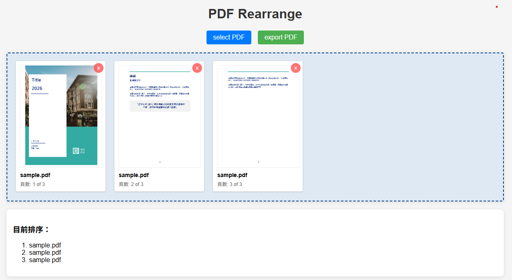

# PDF-Rearrange
Drag and drop to reorder PDF pages and export the sorted PDF file.

## 功能介紹
PDF-Rearrange 是一個前端工具，讓使用者能夠以拖曳方式重新排序 PDF 頁面，並匯出排序後的 PDF 檔案。所有功能皆於瀏覽器端執行，適合快速處理 PDF 頁面順序調整。

## 使用套件

- **[pdf.js](https://github.com/mozilla/pdf.js)**：用於在瀏覽器中解析與預覽 PDF 檔案內容。
- **[pdf-lib](https://github.com/Hopding/pdf-lib)**：用於在瀏覽器端重組及匯出 PDF 檔案。
- **[Sortable.js](https://github.com/SortableJS/Sortable)**：提供拖曳排序功能，提供使用者可直覺調整 PDF 頁面順序功能。

所有套件皆以 CDN 方式於前端載入，無需額外安裝。